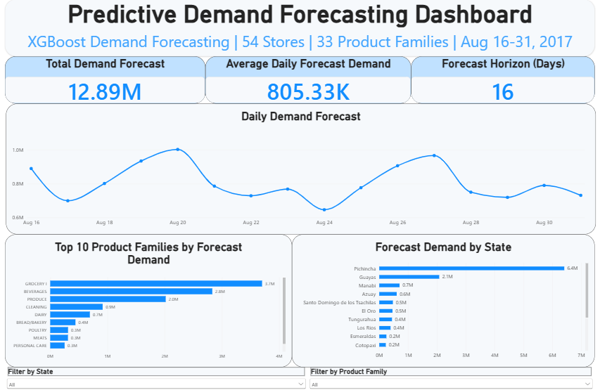
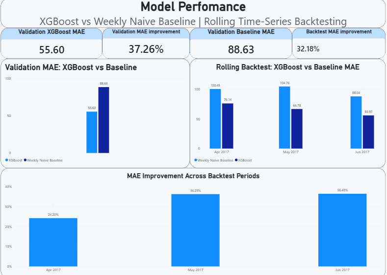

# Predictive Demand Forecasting Platform

An end-to-end demand forecasting and analytics platform built using Python, XGBoost, SQL Server, and Power BI to forecast grocery demand across 54 stores and 33 product families.

The project covers the complete analytics workflow from raw data ingestion and validation through feature engineering, forecasting, rolling backtesting, SQL reporting, and interactive business intelligence dashboards.

## Project Overview

Retail demand forecasting helps organizations anticipate future product demand and support inventory planning, operational decision-making, and performance reporting.

This project uses the Kaggle Store Sales - Time Series Forecasting dataset from Corporación Favorita, an Ecuadorian grocery retailer.

The forecasting problem consists of:

- 54 stores
- 33 product families
- 1,782 store-product time series
- More than 3 million historical sales records
- Historical sales from January 2013 through August 2017
- 16-day future forecasting horizon

The target variable is `sales`, which is treated as product demand.

## Architecture

```text
Raw CSV Data
      |
      v
Data Ingestion & Validation
      |
      v
Data Preprocessing
      |
      v
Feature Engineering
      |
      +--------------------+
      |                    |
      v                    v
Weekly Naive         Holt-Winters
Baseline             Statistical Model
      |
      v
XGBoost Forecasting Model
      |
      v
Time-Series Validation
& Rolling Backtesting
      |
      v
Recursive Future Forecast
      |
      v
SQL Server
      |
      v
Reporting Views
      |
      v
Power BI Dashboard
```

## Feature Engineering

The forecasting pipeline creates time-series and business features including:

- Calendar features: year, month, day, day of week, week of year, quarter
- Weekend indicator
- Promotion indicators
- Holiday information
- Sales lags: 1, 7, 14, and 28 observations
- Rolling demand averages: 7, 14, and 28 observations
- 7-observation rolling standard deviation
- Store and product-family categorical features

Lag and rolling features are generated using only previously recorded observations to avoid target leakage.

## Models

### Weekly Naive Baseline

A weekly naive forecast was used as the primary benchmark. It predicts demand using the corresponding historical lag-7 observation.

### Holt-Winters

A Holt-Winters model was evaluated separately at company-wide daily aggregation with weekly seasonality.

Because this model operates at a different aggregation level, its raw MAE and RMSE values are not directly compared with the store-product XGBoost metrics.

### XGBoost

The primary forecasting model is an `XGBRegressor` trained across the 1,782 store-product demand series.

Key model inputs include:

- Store
- Product family
- Promotions
- Calendar features
- Holiday indicator
- Lagged demand
- Rolling demand statistics

## Model Performance

### Validation Period

Validation period: **July 1 - August 15, 2017**

| Metric | Weekly Naive Baseline | XGBoost | Improvement |
|---|---:|---:|---:|
| MAE | 88.63 | 55.60 | 37.26% |
| RMSE | 331.07 | 207.00 | 37.48% |

The XGBoost model reduced validation MAE by **37.26%** relative to the weekly naive baseline.

The validation period was also used during model selection, so these results are reported as validation performance rather than as an untouched final test set.

### Rolling Backtesting

Three historical rolling backtest windows were used to evaluate performance across different time periods.

| Backtest Period | Baseline MAE | XGBoost MAE | MAE Improvement |
|---|---:|---:|---:|
| April 2017 | 100.45 | 76.14 | 24.20% |
| May 2017 | 104.76 | 66.78 | 36.25% |
| June 2017 | 88.04 | 55.97 | 36.43% |

Across the three backtest windows:

- Baseline MAE: **97.75**
- XGBoost MAE: **66.30**
- Overall MAE improvement: **32.18%**

XGBoost outperformed the weekly naive baseline in each rolling backtest period.

## Future Demand Forecast

The trained model generates recursive forecasts for:

**August 16 - August 31, 2017**

Forecast scope:

- 16 days
- 54 stores
- 33 product families
- 28,512 store-family-date predictions

Recursive forecasting updates lag and rolling features as each new day's predictions are generated.

## SQL Server Reporting Layer

Forecast and historical data are loaded into SQL Server for downstream reporting.

Core tables include:

- `Stores`
- `HistoricalSales`
- `Forecasts`

SQL reporting views provide aggregated historical and forecast data for Power BI.

SQL scripts are available in the `sql/` directory.

## Power BI Dashboard

The Power BI report contains two pages.
### Dashboard Preview

#### Demand Forecast



#### Model Performance



### Demand Forecast

Provides operational forecast visibility including:

- Total forecast demand
- Average daily forecast demand
- Forecast horizon
- Daily demand forecast
- Top product families by forecast demand
- Forecast demand by state
- Interactive state and product-family filters

### Model Performance

Provides model evaluation and validation information including:

- Validation XGBoost MAE
- Validation baseline MAE
- Validation MAE improvement
- Overall rolling-backtest improvement
- XGBoost vs baseline comparison
- Rolling backtest performance
- MAE improvement across backtest periods

The Power BI `.pbix` file is available in the `powerbi/` directory.

## Project Structure

```text
Predictive-Demand-Forecasting/
|
|-- data/
|   |-- raw/
|   |-- processed/
|   `-- forecasts/
|
|-- models/
|-- notebooks/
|   `-- demand_forecasting_eda.ipynb
|
|-- powerbi/
|   `-- predictive demand forecasting dashboard.pbix
|
|-- sql/
|   |-- create_tables.sql
|   |-- load_data.sql
|   `-- reporting_views.sql
|
|-- src/
|   |-- data_ingestion.py
|   |-- data_validation.py
|   |-- preprocessing.py
|   |-- feature_engineering.py
|   |-- train_statistical.py
|   |-- train_xgboost.py
|   |-- evaluate.py
|   |-- backtest.py
|   |-- forecast.py
|   |-- load_to_sql.py
|   `-- database.py
|
|-- main.py
|-- requirements.txt
|-- .env.example
|-- .gitignore
`-- README.md
```

## Technologies

**Programming & Analytics**
- Python
- Pandas
- NumPy
- Scikit-learn
- XGBoost
- Statsmodels

**Data Engineering & Database**
- SQL
- Microsoft SQL Server
- PyODBC

**Visualization**
- Power BI
- Matplotlib

**Development**
- Git
- VS Code
- Jupyter

## Dataset

This project uses the public **Store Sales - Time Series Forecasting** dataset provided through Kaggle.

Large raw and generated datasets are excluded from this repository through `.gitignore`.

To reproduce the project, download the dataset and place the source CSV files in:

```text
data/raw/
```

## Key Takeaways

- Built an end-to-end forecasting pipeline across **1,782 store-product time series**
- Processed more than **3 million historical sales records**
- Improved validation MAE by **37.26%** versus a weekly naive baseline
- Achieved **32.18% overall MAE improvement** across three rolling backtest windows
- Generated **28,512 future demand predictions**
- Integrated forecasting outputs with **SQL Server**
- Built an interactive **two-page Power BI dashboard** for operational forecasting and model-performance reporting

## Future Improvements

Potential extensions include:

- Correcting and standardizing store-aware holiday features across both training and forecasting pipelines
- Adding an untouched final holdout period
- Automated model retraining and scheduled forecast generation
- Power BI scheduled refresh
- Model monitoring and drift detection
- Additional hyperparameter optimization
- Cloud deployment of the forecasting pipeline